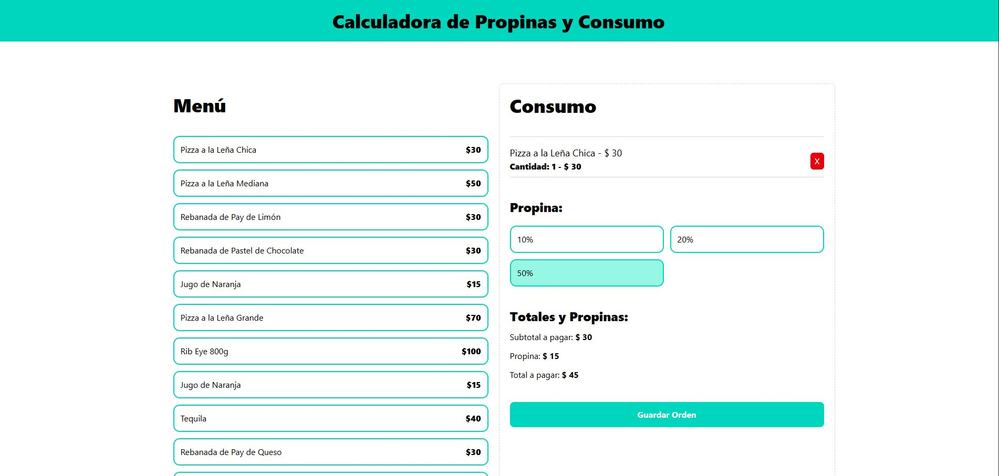

## 💰 Calculadora de Propinas y Consumos

Este proyecto permite seleccionar platillos de un menú predefinido, sumar su costo y calcular la propina deseada para obtener el total. Ideal para dividir cuentas de manera clara y rápida.

🔗 [Live Demo](https://calculadora-de-propinas-usereducerf.netlify.app/)

### 🚀 Vista previa

 <!-- Cambia esta ruta si tienes una imagen del proyecto -->

---

### 🔧 Tecnologías utilizadas

---

### ⚙️ Funcionalidades

| Funcionalidad                  | Descripción                                                   |
|-------------------------------|---------------------------------------------------------------|
| ✅ Selección de platillos     | Elige de una lista de alimentos predefinidos                  |
| ✅ Cálculo automático         | Calcula el subtotal y la propina según el porcentaje elegido  |
| ✅ Estado global con reducer  | Manejo del estado centralizado con `useReducer`               |
| ✅ Optimización con useMemo   | Evita recálculos innecesarios en valores de pago              |
| ✅ Interfaz visual clara      | UI diseñada con Tailwind CSS para una experiencia fluida      |

---

## 🥗 Calorie Counter

This project allows you to track calories consumed (food) and burned (exercise). You can add, update or remove entries. The total is automatically updated based on the type of activity.

🔗 [Live Demo](https://contador-de-calorias05.netlify.app/)

### 🚀 Preview

 <!-- Replace this path with an actual screenshot if available -->

---

### 🔧 Tech Stack

---

### ⚙️ Features

| Feature                       | Description                                                   |
|------------------------------|---------------------------------------------------------------|
| ✅ Add food                  | Add positive-calorie food entries                             |
| ✅ Add exercise              | Add negative-calorie exercise entries                         |
| ✅ Auto calculation          | Total updates according to type of entry                      |
| ✅ Global state with reducer| Uses `useReducer` to manage global state                      |
| ✅ Optimized with useMemo    | Prevents unnecessary total recalculations                     |
| ✅ Local persistence         | Saves data in `localStorage` for session persistence          |

---
